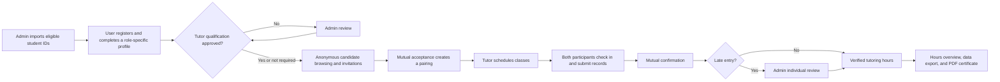

# MPTS — Mandarin Practicum and Tutoring System

MPTS is a bilingual, privacy-aware web platform for managing Mandarin teaching practica, peer tutoring, and language-partner programs.

The project is being developed for the Department of Chinese as a Second Language at National Taiwan Normal University (NTNU). It replaces a paper-heavy administrative workflow with a shared system for roster-based registration, privacy-preserving matching, class scheduling, mutual attendance and record verification, tutoring-hour accounting, certificates, and administrative oversight.

> **Project status:** Active development and pre-production security hardening. The core V3/V3.1 workflows are implemented; production deployment, institutional security review, and full browser-based acceptance testing are in progress.

## Why MPTS Exists

The department coordinates several related activities:

- graduate students completing practicum or tutoring requirements;
- undergraduate students participating through courses or partner programs;
- international students receiving Mandarin tutoring;
- partner-university students participating in language exchange; and
- department staff reviewing qualifications, exceptions, hours, and certificates.

Previously, much of this work was managed on paper or across disconnected files. That made it difficult to verify eligibility, prevent conflicting matches, follow class completion, review late records, and produce reliable hour summaries. MPTS provides one auditable workflow designed for approximately 300–600 users.

## Core Capabilities

### Accounts and eligibility

- Roster-based registration: a student ID must exist in an administrator-imported roster before an account can be created.
- One student ID maps to one system role.
- Role and partner-program eligibility are determined by roster data rather than selected by the registrant.
- Two-stage profile setup with bilingual field labels and responsive layouts.
- Tutor oral-proficiency document submission and administrative review.
- Password recovery using the security questions selected during registration.

### Privacy-aware matching

- Tutor and student candidate lists reveal only the information required for matching.
- Names, student IDs, email addresses, and other direct identifiers remain hidden before a match is accepted.
- Invitations expire automatically and matching limits are enforced by the service layer.
- Program-scoped eligibility supports NTNU tutoring, the University of Maryland language-partner program, and future partner programs.
- Either participant may request a pairing release; selected reasons can be released automatically after the configured review window.

### Classes and mutual verification

- Tutors schedule one-time or weekly recurring classes in five-minute time increments.
- Reserved hours are checked before classes are added or changed.
- Both participants check in, submit class records, and confirm each other's attendance and record.
- Late check-ins or records require mutual confirmation and individual Admin approval before the hours become valid.
- Class alerts and incident reports provide an administrative record without turning every incomplete class into an Admin task.

### Hours, certificates, and administration

- Reserved and verified hours are calculated from class state rather than manually entered totals.
- Users can review hours by semester or date range.
- Bilingual summary and detailed PDF certificates are generated from verified records.
- Admins can manage rosters, partner programs, semester periods, manual pairings, qualification reviews, release requests, late-entry reviews, class alerts, incidents, and hour adjustments.
- Administrative exports support XLSX, CSV, and PDF with selectable users, periods, and fields.
- Audit records capture important administrative and workflow changes.

## User Roles

| Role | Main responsibilities |
| --- | --- |
| **Admin** | Import rosters, configure programs and semesters, review tutor qualifications and exceptional records, oversee pairings and classes, export data, and inspect audit history. |
| **Tutor / Teacher** | Complete a teaching profile, pass the required qualification review, browse eligible students, manage invitations, schedule classes, check in, submit records, confirm the student's record, communicate with matched students, and download certificates. |
| **Tutee / Student** | Complete a learning profile, review eligible invitations, check the class schedule, check in, submit records, confirm the teacher's record, communicate with the matched teacher, and download a certificate when enabled for the partner program. |

The interface uses **Teacher** and **Student** for end users. `Tutor` and `Tutee` are retained as domain terms in the codebase.

## End-to-End Workflow



## Selected Business Rules

- A student ID can register only once and can have only one role.
- A regular student can have one active Tutor within a program period.
- Standard NTNU tutoring allows a Tutor to have up to two active students; Admin-created pairings can support separately governed future programs.
- Standard hour limits are two scheduled hours per pair per Monday–Sunday week, 32 hours per pair, and 64 hours per Tutor per semester unless a future program defines a reviewed exception.
- A class may reserve 0.5, 1, 1.5, or 2 hours. Reserved future classes consume the applicable quota until changed or cancelled.
- Check-in opens ten minutes before the scheduled start time.
- Past classes may be changed or cancelled within the permitted three-week correction window.
- Late attendance and late class records count only after both participants confirm them and Admin approves the request.
- Pairings end automatically with their semester or program period, while message history remains available.

The authoritative and more detailed rules are maintained in [`CLAUDE.md`](CLAUDE.md). Current implementation status and unresolved product decisions are tracked in [`docs/PROGRESS.md`](docs/PROGRESS.md).

## Technology

- Python 3.12
- Django 5.2 LTS
- PostgreSQL 18
- psycopg 3
- Pillow, ReportLab, and pypdf for image and PDF processing
- openpyxl for spreadsheet exports
- Server-rendered Django templates with responsive CSS and small, focused JavaScript modules
- GitHub Actions for linting, dependency auditing, migration checks, tests, and Django deployment checks

MPTS intentionally does not depend on a JavaScript frontend framework or a public REST API. It also does not currently integrate with Google, OAuth, institutional SSO, email, SMS, GPS, payment providers, external calendars, or video-conferencing services.

## Repository Structure

```text
accounts/       Accounts, rosters, profiles, registration, and Admin workflows
tutoring/       Matching, classes, records, messages, hours, and certificates
templates/      Server-rendered bilingual Django templates
static/         CSS, JavaScript, and image assets
config/         Django project settings and URL configuration
docs/           Progress, deployment, security, and product decision records
assets/fonts/   Licensed fonts used for generated certificates
```

## Local Development

### Prerequisites

- Python 3.12
- PostgreSQL 18
- Git

### 1. Clone and install

```bash
git clone https://github.com/Karma-1827/CSL.git
cd CSL
python3.12 -m venv .venv
source .venv/bin/activate
python -m pip install --upgrade pip
pip install -r requirements-dev.txt
```

### 2. Create a local database

Create a PostgreSQL database and user using your preferred administration tool. For example:

```sql
CREATE USER mpts_dev WITH PASSWORD 'replace-this-local-password';
CREATE DATABASE mpts_dev OWNER mpts_dev;
```

Set the development environment variables in your shell:

```bash
export DJANGO_DEBUG=1
export DJANGO_SECRET_KEY='development-only-secret-key'
export DJANGO_ALLOWED_HOSTS='localhost,127.0.0.1'
export POSTGRES_DB='mpts_dev'
export POSTGRES_USER='mpts_dev'
export POSTGRES_PASSWORD='replace-this-local-password'
export POSTGRES_HOST='localhost'
export POSTGRES_PORT='5432'
```

The repository includes [`.env.example`](.env.example) as a reference, but Django does not automatically load `.env` files. Export the values in the shell or load them through your local process manager.

### 3. Initialize and run

```bash
python manage.py migrate
python manage.py createsuperuser
python manage.py runserver 127.0.0.1:8001
```

Open <http://127.0.0.1:8001/>. The Django administration site is available at <http://127.0.0.1:8001/system-admin/> in development.

## Background State Processing

Invitation expiry, semester completion, and automatic pairing-release transitions are handled by a management command:

```bash
python manage.py process_matching_state
```

Run it periodically in production through a systemd timer or equivalent scheduler. The current deployment recommendation is once per minute.

## Quality Checks

Run the same checks used by CI before opening a pull request:

```bash
source .venv/bin/activate
ruff check .
python manage.py makemigrations --check --dry-run
python manage.py test --verbosity 1
pip check
pip-audit
```

Run Django's production checks with explicit non-production verification values:

```bash
DJANGO_DEBUG=0 \
DJANGO_SECRET_KEY='deployment-check-only-secret-key-that-is-long-and-random' \
DJANGO_ALLOWED_HOSTS='mpts.example.ntnu.edu.tw' \
python manage.py check --deploy
```

Do not use those example secrets in a deployed environment.

## Security and Privacy

MPTS handles student identity data, qualification documents, class records, messages, and administrative audit history. The design therefore emphasizes:

- minimum disclosure before matching;
- role- and relationship-based authorization;
- CSRF protection and server-side validation;
- password and security-answer hashing;
- session inactivity timeouts;
- auditable administrative actions; and
- controlled generation of official records.

The project is currently completing production hardening for private attachment delivery, shared authentication throttling, browser security headers, upload validation, and NTNU's vulnerability-scanning process. Do not deploy the current development configuration directly to a public server. See [`docs/DEPLOY.md`](docs/DEPLOY.md) for the deployment checklist.

Never commit real student records, uploaded documents, database dumps, credentials, or production environment files.

## Documentation

- [`CLAUDE.md`](CLAUDE.md) — authoritative domain rules and coding-agent context
- [`docs/PROGRESS.md`](docs/PROGRESS.md) — implementation status, known gaps, and pending decisions
- [`docs/DEPLOY.md`](docs/DEPLOY.md) — production deployment checklist
- [`docs/SECURITY_CHECKLIST.md`](docs/SECURITY_CHECKLIST.md) — institutional security-control mapping

## Contributing

The project is currently maintained as an active departmental system and is being prepared for a public open-source release. Contribution guidelines, a code of conduct, a security reporting policy, and issue templates will be added before external contributions are accepted.

If you are evaluating or contributing to the project, start with this README and `CLAUDE.md`, preserve existing migrations and user data, add tests for permission-sensitive changes, and never commit demo credentials or personal data.

## License

An open-source license has not yet been selected. Until a license file is added, the source code remains all rights reserved and may not be redistributed or reused. A license must be chosen before the repository is presented as an open-source project or accepts external contributions.
